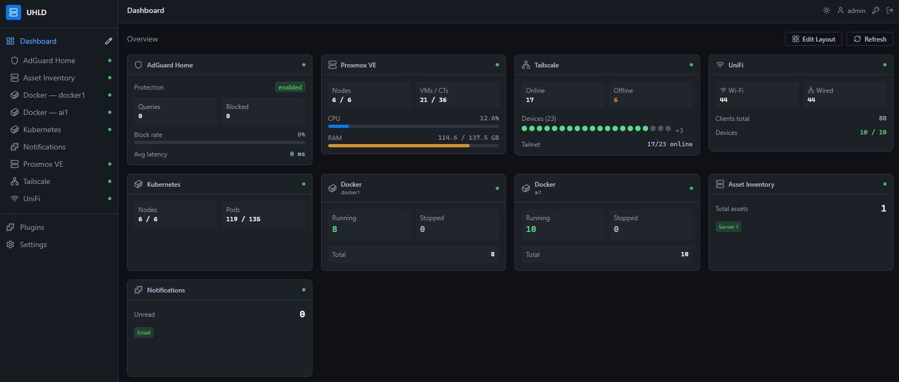

# UHLD — Ultimate Homelab Dashboard

> **Work in progress — under heavy development. Expect breaking changes.**

A self-hosted, plugin-driven dashboard for your homelab. Monitor and manage Proxmox, Docker, Kubernetes, AdGuard, TrueNAS, Plex, and more from a single unified interface.

> This project is built entirely using [Claude Code](https://claude.ai/code), Anthropic's agentic coding tool.



---

## What it is

UHLD is the homelab equivalent of Home Assistant — but for infrastructure instead of home automation. Deploy it as a single Docker container, enable plugins for the services you run, and get a unified dashboard to monitor and interact with your entire homelab from one place.

- **Plugin-first** — every integration is a plugin, nothing is hardcoded
- **Multi-instance** — run multiple instances of any plugin (two Proxmox clusters, two UniFi controllers, etc.)
- **Read/monitor by default** — write and action operations always require explicit intent
- **Single container** — FastAPI backend + React frontend, one Docker image
- **Credential encryption** — all plugin secrets are encrypted at rest
- **Light/dark theme** — CSS-variable-backed adaptive theme with toggle
- **Drag-to-reorder dashboard** — customizable widget layout persisted per-browser

---

## Current Status

| Feature | Status |
|---------|--------|
| Core framework (auth, plugin registry, settings) | ✅ Complete |
| First-launch setup (auto admin/admin, forced password change) | ✅ Complete |
| Light / dark mode toggle | ✅ Complete |
| Drag-to-reorder dashboard tiles | ✅ Complete |
| Multi-instance plugin support | ✅ Complete |
| Multi-user with admin / viewer roles | ✅ Complete |
| TOTP 2FA (Google Authenticator, Authy) | ✅ Complete |
| Passkeys / WebAuthn (YubiKey, Touch ID, Face ID, Windows Hello) | ✅ Complete |
| OAuth / OIDC (Entra ID, Google, GitHub) | ✅ Complete |
| Proxmox VE plugin (nodes, host drill-down, VM/CT topology tree, performance graphs, start/stop/reboot) | ✅ Complete |
| AdGuard Home plugin (stats, query log, protection toggle) | ✅ Complete |
| Pi-hole plugin (stats, query log, blocking toggle) | ✅ Complete |
| Tailscale plugin (devices, users, DNS, ACL editor, sidecar status) | ✅ Complete |
| UniFi plugin (clients, devices, ports, networks, WiFi, firewall) | ✅ Complete |
| Docker plugin (containers, images, logs, start/stop/restart) | ✅ Complete |
| Kubernetes plugin (nodes, workloads, networking, storage, logs, shell, YAML editor) | ✅ Complete |
| Notifications plugin (email, Telegram, webhook) | ✅ Complete |
| Configuration backup & restore | ✅ Complete |
| Asset Inventory plugin | ✅ Complete |
| Plex / Jellyfin / TrueNAS / Synology | Planned |

---

## Tech Stack

- **Backend:** Python 3.12, FastAPI, SQLAlchemy async + aiosqlite, APScheduler
- **Frontend:** React 18, TypeScript, Vite, Tailwind CSS, Zustand, dnd-kit
- **Auth:** JWT (httpOnly cookie), bcrypt, TOTP (`pyotp`), WebAuthn (`py-webauthn`), OAuth 2.0 / OIDC
- **Storage:** SQLite — zero external dependencies
- **Deployment:** Multi-stage Docker (node:20-alpine → python:3.12-slim)

---

## Quick Start

### Requirements

- Docker and Docker Compose

### Generate secrets

```bash
python -c "import secrets; print(secrets.token_hex(32))"                               # JWT_SECRET
python -c "from cryptography.fernet import Fernet; print(Fernet.generate_key().decode())"  # ENCRYPTION_KEY
```

### docker-compose.yml

```yaml
services:
  uhld:
    image: ghcr.io/mzac/uhld:latest
    ports:
      - "8222:8000"
    volumes:
      - ./data:/data
    environment:
      - JWT_SECRET=your_jwt_secret_here
      - ENCRYPTION_KEY=your_fernet_key_here
      - TZ=America/New_York
    restart: unless-stopped
```

```bash
docker compose up -d
```

Then open `http://localhost:8222`.

### First login

On first launch UHLD auto-creates an **`admin` / `admin`** account and immediately prompts you to set a new password before continuing.

---

## ⚠️ Security Considerations

**USE AT YOUR OWN RISK.** UHLD has access to sensitive infrastructure data and control operations across your entire homelab. Treat it with the same security care you would any administrative dashboard.

### What UHLD Can Access

- **Proxmox:** VM/LXC lifecycle, host information, storage, resource usage
- **Docker:** Container lifecycle (start/stop/restart), log access, image inventory
- **Kubernetes:** Pod/deployment management, container logs, **interactive shell exec into any running pod**, direct YAML patch/apply to cluster resources — treat this as equivalent to `kubectl` access
- **UniFi:** Network devices, clients, WiFi settings, firewall rules
- **Tailscale:** Node management, user access, DNS, ACLs
- **AdGuard/Pi-hole:** DNS blocking rules, query logs
- **All plugins:** Any credentials you provide are stored and used to access those services

An attacker who gains access to UHLD can:
- View sensitive data from all connected services
- Start/stop/reboot VMs and containers
- Modify network configurations
- Access logs and diagnostics containing PII or secrets
- **Execute an interactive shell inside any running Kubernetes pod** — including pods with access to databases, secrets, internal APIs, or service account tokens
- **Apply arbitrary YAML to your Kubernetes cluster** — equivalent to having `kubectl apply` access
- Potentially pivot to other infrastructure components via pod environments, mounted secrets, or service accounts

### Security Best Practices

**Always:**
- ✅ Use **strong, unique passwords** for the UHLD admin account — this is your primary defense
- ✅ Enable **TOTP 2FA** or register a **passkey** — both are available in Settings → Account
- ✅ Keep UHLD on a **private network or VPN** — never expose the web interface directly to the public internet
- ✅ Access only via **HTTPS with valid certificates** in production
- ✅ Use **separate credentials** for UHLD that differ from your personal/primary passwords
- ✅ Limit access to **trusted users only** — use role-based access control (Settings → Users)
- ✅ Keep UHLD and all connected services **patched and up-to-date**
- ✅ Regularly **rotate credentials** for service accounts (API keys, tokens, passwords)
- ✅ Monitor **logs and audit trails** for suspicious activity
- ✅ Back up and **encrypt your database** (`/data/uhld.db`) — it contains encrypted credentials and configuration

**Never:**
- ❌ Use default credentials (`admin/admin`) in production — change immediately
- ❌ Expose UHLD to the public internet without proper authentication and TLS
- ❌ Share the `JWT_SECRET` or `ENCRYPTION_KEY` — regenerate if compromised
- ❌ Store credentials in plain text or commit them to version control
- ❌ Ignore security updates or plugin vulnerabilities

### Deployment Recommendations

**For homelab/home use:**
- Deploy behind a **firewall or NAT** (not port-forwarded to the internet)
- Access via **Tailscale VPN** for remote access (use the Tailscale plugin for easy setup)
- Disable plugins you don't use to reduce attack surface

**For production/shared environments:**
- Deploy in a **private network** with network segmentation
- Use a **reverse proxy** (nginx, Traefik) with authentication (OAuth, OIDC)
- Enable **HTTPS with valid certificates**
- Implement **rate limiting** and **WAF rules**
- Use **secrets management** for all credentials (HashiCorp Vault, K8s Secrets)
- Enable **audit logging** and **monitoring**
- Implement **least-privilege access** — separate admin, operator, and viewer roles

### Reporting Security Issues

If you discover a security vulnerability, **do not open a public issue.** Please contact the maintainers privately so the issue can be patched before disclosure.

---

## Environment Variables

| Variable | Required | Description |
|----------|----------|-------------|
| `JWT_SECRET` | Yes | JWT signing secret |
| `ENCRYPTION_KEY` | Yes | Fernet key for encrypting plugin credentials |
| `DATABASE_PATH` | No | SQLite path (default: `/data/uhld.db`) |
| `TZ` | No | Timezone (default: `America/Montreal`) |
| `LOG_LEVEL` | No | Python log level (default: `INFO`) |
| `WEBAUTHN_RP_ID` | No | Passkey relying-party ID — hostname only (auto-derived from request if unset) |
| `WEBAUTHN_RP_NAME` | No | Display name shown in passkey prompts (default: `UHLD`) |
| `WEBAUTHN_ORIGIN` | No | Full origin URL for WebAuthn (auto-derived from request if unset) |
| `OAUTH_BASE_URL` | No | Base URL of this UHLD instance — used for OAuth redirect URIs |
| `OAUTH_AUTO_PROVISION` | No | `true` to auto-create local accounts on first OAuth login (default: `false`) |
| `OAUTH_ENTRA_CLIENT_ID` | No | Microsoft Entra ID (Azure AD) app client ID |
| `OAUTH_ENTRA_CLIENT_SECRET` | No | Microsoft Entra ID app client secret |
| `OAUTH_ENTRA_TENANT_ID` | No | Entra tenant ID or `common` for multi-tenant |
| `OAUTH_GOOGLE_CLIENT_ID` | No | Google OAuth 2.0 client ID |
| `OAUTH_GOOGLE_CLIENT_SECRET` | No | Google OAuth 2.0 client secret |
| `OAUTH_GITHUB_CLIENT_ID` | No | GitHub OAuth app client ID |
| `OAUTH_GITHUB_CLIENT_SECRET` | No | GitHub OAuth app client secret |

---

## Plugin Configuration

Plugins are enabled and configured through **Settings → Plugins**. Each plugin's form is rendered dynamically from its JSON Schema — no manual config files needed. Sensitive fields (API keys, passwords, tokens) are encrypted before being stored.

### Multi-instance plugins

Any plugin can be enabled more than once with different connection settings. Use the **Add instance** button in Settings → Plugins to add a second instance (e.g., a second Proxmox cluster or UniFi controller). Each instance has its own sidebar entry and dashboard tile.

---

## Tailscale Sidecar (optional)

UHLD can run as a Tailscale node to expose itself over your tailnet with HTTPS via MagicDNS. Use the provided `docker-compose.local.yml` and `build-run-local.sh` as a reference. Requires `TS_AUTHKEY` in `.env.local`.

When a Tailscale sidecar is detected (Unix socket at `/var/run/tailscale/tailscaled.sock`), the Tailscale plugin view shows a live local status bar with node name, IP, and connection state.

---

## Development

```bash
# Backend
pip install -r requirements.txt
uvicorn backend.main:app --reload --host 0.0.0.0 --port 8000

# Frontend
cd frontend && npm install && npm run dev
# Vite proxies /api/* to localhost:8000

# Local Docker build (with Tailscale sidecar)
./build-run-local.sh   # requires .env.local with TS_AUTHKEY

# Standard Docker build
./build-run.sh
```

---

## Related Projects

This project shares its architecture and code style with [apt-ui](https://github.com/mzac/apt-ui), a self-hosted apt package management dashboard — also built entirely with Claude Code.

---

## License

MIT
